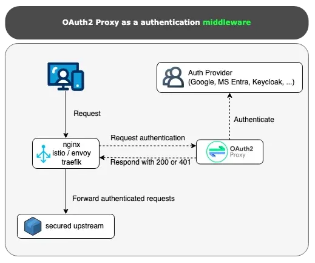

## Overview
This project demonstrates how to integrate Traefik Ingress Controller with Okta OAuth2 authentication in a Kubernetes environment. It showcases:

- Setting up Traefik as an ingress controller in Kubernetes
- Configuring Traefik middleware for OAuth2-Proxy authentication
- Integration with Okta as the identity provider
- Testing the setup using Traefik's whoami service

The implementation provides secure, authenticated access to Kubernetes services through Traefik's OAuth2 middleware capabilities.

The architecture will follow



## Minikube with Docker Driver Setup

### Prerequisites

- Docker Desktop
- Minikube
- kubectl

### Installation

1. Install Minikube:
```bash
brew install minikube
```

2. Start Minikube with Docker driver:
```bash
minikube start --driver=docker
```

3. Verify installation:
```bash
minikube status
kubectl get nodes
```

## Deploy Traefik Ingress Controller and Whoami Service

1. Create namespace for Traefik:
```bash
kubectl create namespace traefik
```

2. Add Traefik Helm repository:
```bash
helm repo add traefik https://traefik.github.io/charts
helm repo update
```

3. Install Traefik using Helm:
```bash
helm install traefik traefik/traefik --namespace=traefik --set="additionalArguments={--log.level=DEBUG}"
```

4. Deploy whoami service:
```bash
kubectl create deployment whoami --image=traefik/whoami
kubectl expose deployment whoami --port=80
```

5. Verify deployments:
```bash
kubectl get pods -n traefik
kubectl get svc -n traefik
```

6. Check if whoami service is accessible:
```bash
kubectl port-forward svc/whoami 8000:80
```
Verify that http://localhost:8000 displays the OS information and HTTP request.

## Install Traefik CRD and RBAC definitions to the cluster

1. Install CRD
```bash
kubectl apply -f https://raw.githubusercontent.com/traefik/traefik/v3.3/docs/content/reference/dynamic-configuration/kubernetes-crd-definition-v1.yml
```

2. Install RBAC
```bash
kubectl apply -f https://raw.githubusercontent.com/traefik/traefik/v3.3/docs/content/reference/dynamic-configuration/kubernetes-crd-rbac.yml
```

## Install Oauth2-Proxy

```bash
kubectl apply -f oauth2-proxy/oauth2-proxy.yaml
```

## Configure Traefik Middleware and IngressRoute towards Oauth2-proxy

1. Create a self-signed certificate and a K8s secret
```bash
openssl req -x509 -newkey rsa:4096 -keyout key.pem -out cert.pem -sha256 -days 3650 -nodes -subj "/CN=auth.example.com"
kubectl create secret tls auth-tls-secret --key key.pem --cert cert.pem --namespace default
```

1. Create Middleware and IngressRoute:
```bash
kubectl apply -f ingress/traefik-middleware.yaml
kubectl apply -f ingress/traefik-ingressroute.yaml
```

2. Verify configuration:
```bash
kubectl get middleware
kubectl get ingressroute
```

## Verify the flow

1. Go to a browser and run `https://auth.example.com/whoami`
2. This should redirect to Okta login page , signin with credentials and verify with MFA.
3. For an authenticated user you should be redirected back to `/whoami` which displays user info and OS info.
